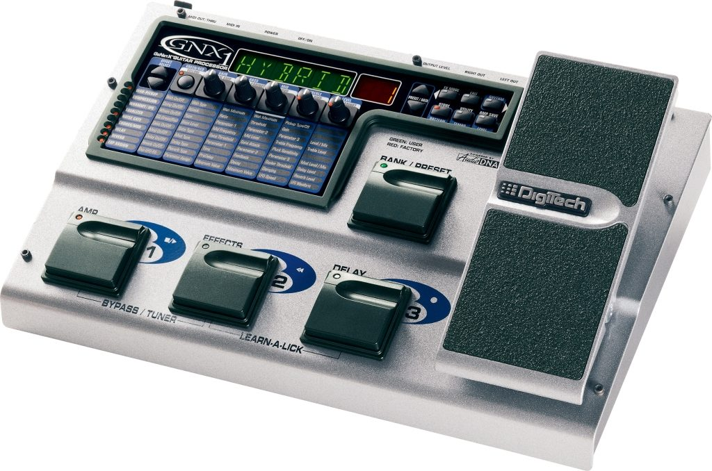

<h1 align="center">Digitech-GNX1-System-Exclusive</h1>
<h2 align = "center">Details of Digitech GNX1 MIDI System Exclusive Commands</h2>

The Digitech GNX1 is a powerful vintage guitar effects processor which shipped with the GENEdit software package for editing from a Windows machine. I wanted to create a Linux of that software, and so I contacted Digitech for documentation on the MIDI System Exclusive messages which the software uses to communicate with the device. Unfortunately, Digitech had nothing they could give me, so I set about decoding the transmitted messages.
This document describes what I have discovered to date. It may not be complete but there is enough for me to build my editing software, built in the Python programming language using the Qt framework, which should mean that it is cross-platform.
My software is called GNXEdit and is available on GitHub as an open source project (although currently in development) at https://github.com/gary-1959/GNXEdit.
